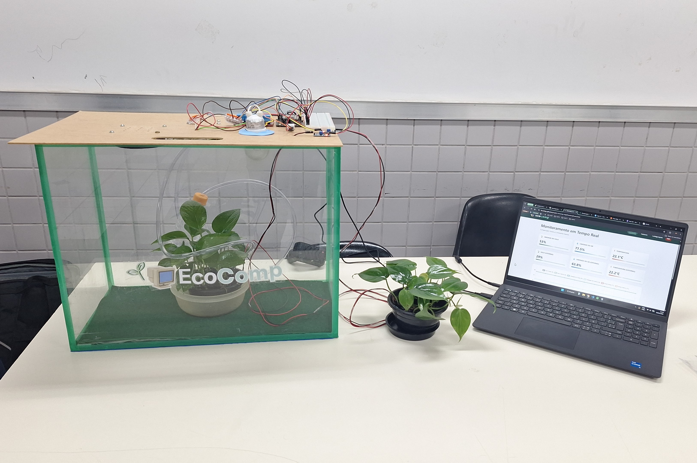

# 🌱 EcoComp - Inteligência Computacional Aplicada ao Monitoramento de Ecossistemas

<p align="center">
  
</p>

<p align="center">
Sistema de monitoramento e automação de estufas inteligentes utilizando <strong>ESP32</strong>, <strong>HTTP</strong>, <strong>Node.js</strong>, <strong>MongoDB Atlas</strong> e <strong>Aplicação Web</strong>.
</p>

---

O **EcoComp** é um sistema de monitoramento e automação de estufas inteligentes desenvolvido utilizando conceitos de **Internet das Coisas (IoT)**, **Computação em Nuvem**, **Sistemas Embarcados** e **Desenvolvimento Web**.

O projeto permite acompanhar em tempo real as condições ambientais de uma estufa por meio de sensores conectados a um **ESP32**, que envia os dados para uma **API REST** através de requisições **HTTP**. Além disso, é possível controlar remotamente dispositivos de irrigação, ventilação e aquecimento utilizando uma aplicação web.

---

# 🚀 Funcionalidades

## 📊 Monitoramento em Tempo Real

- Temperatura interna da estufa
- Umidade do ar interna
- Umidade do solo interna
- Temperatura externa
- Umidade do ar externa
- Umidade do solo externa

## 🤖 Automação Inteligente

- Acionamento automático da bomba de irrigação
- Controle automático da ventoinha
- Controle automático da lâmpada de aquecimento
- Configuração dos limites de automação diretamente pela aplicação web

## 🌐 Aplicação Web

- Cadastro de usuários
- Login e autenticação
- Dashboard em tempo real
- Histórico de medições
- Filtros por período
- Exportação de relatórios
- Controle manual dos atuadores

## ☁️ Infraestrutura

- Comunicação HTTP (REST)
- API REST em Node.js
- Banco de Dados MongoDB Atlas
- Hospedagem da API no Render
- Controle de versão com Git e GitHub

---

# 🏗️ Arquitetura do Sistema

```text
           ┌─────────────────┐
           │     Sensores    │
           │ DHT22 e Solo    │
           └────────┬────────┘
                    │
                    ▼
           ┌─────────────────┐
           │      ESP32      │
           │ Coleta dos dados│
           └────────┬────────┘
                    │ HTTP
                    ▼
           ┌─────────────────┐
           │    API REST     │
           │    Node.js      │
           └────────┬────────┘
                    │
                    ▼
           ┌─────────────────┐
           │ MongoDB Atlas   │
           └────────┬────────┘
                    │
                    ▼
           ┌─────────────────┐
           │ Aplicação Web   │
           │ Dashboard       │
           │ Histórico       │
           │ Configurações   │
           └─────────────────┘
```

---

# 🔧 Tecnologias Utilizadas

## Hardware

- ESP32
- 2 Sensores DHT22
- 2 Sensores de Umidade do Solo
- Bomba de Irrigação
- Ventoinha
- Lâmpada

## Software

### Backend

- Node.js
- Express.js
- MongoDB Atlas
- JWT
- bcrypt

### Frontend

- HTML5
- CSS3
- JavaScript

### Infraestrutura

- HTTP
- REST API
- Render
- GitHub

---

# 📂 Estrutura do Projeto

```text
projeto-ecocomp-http
│
├── frontend
│   ├── home.html
│   ├── historico.html
│   ├── config.html
│   ├── login.html
│   ├── cadastro.html
│   ├── script.js
│   ├── historico.js
│   ├── config.js
│   └── style.css
│
├── script.js (backend)
│
├── Estufa.jpeg
│
└── README.md
```

---

# 🧩 Padrão Arquitetural

O backend foi desenvolvido seguindo o padrão **MVC (Model-View-Controller)**.

## Model

Responsável pela representação dos dados e integração com o MongoDB.

## Controller

Recebe as requisições HTTP e coordena o fluxo de execução.

## Service

Implementa as regras de negócio do sistema:

- Processamento das leituras dos sensores
- Automação da estufa
- Controle dos atuadores
- Validação das requisições HTTP

## DAO

Responsável pelo acesso ao banco de dados.

## Router

Define as rotas da API.

## Middleware

Realiza autenticação e validações.

---

# 🌐 Comunicação HTTP

O ESP32 envia periodicamente as leituras dos sensores para a API utilizando requisições HTTP.

## Envio de Telemetria

```http
POST /api/readings
```

Exemplo de corpo da requisição:

```json
{
  "deviceId": "estufa-001",
  "soil": 45,
  "airTemp": 24,
  "airHumidity": 62,
  "soilExternal": 40,
  "tempExternal": 22,
  "airHumidityExternal": 65
}
```

## Controle dos Atuadores

A aplicação web envia comandos para os dispositivos através da API.

```http
PUT /api/actuators/:deviceId
```

Exemplo:

```json
{
  "bomba": true,
  "ventoinha": false,
  "lampada": false
}
```

## Configuração da Automação

```http
PUT /api/configs/:deviceId
```

Exemplo:

```json
{
  "soloMin": 40,
  "tempMax": 32,
  "tempMin": 18
}
```

---

# 🤖 Regras de Automação

O sistema realiza automaticamente o controle dos atuadores com base nos limites configurados.

## Irrigação

```text
Se umidade do solo ≤ soloMin
→ Liga a bomba
```

## Resfriamento

```text
Se temperatura ≥ tempMax
→ Liga a ventoinha
```

## Aquecimento

```text
Se temperatura ≤ tempMin
→ Liga a lâmpada
```

---

# 🗄️ Banco de Dados

O MongoDB Atlas utiliza as seguintes coleções:

## devices

Cadastro das estufas monitoradas pelo sistema.

## readings

Histórico completo das medições realizadas pelos sensores.

## configs

Configurações de automação da estufa.

## actuators

Estado atual dos atuadores.

## users

Usuários cadastrados na plataforma.

---

# 📸 Funcionalidades da Interface

## Dashboard

- Dados em tempo real
- Comparação entre ambiente interno e externo
- Indicadores visuais

## Histórico

- Últimas 24 horas
- Últimos 7 dias
- Últimos 30 dias
- Período personalizado

## Configurações

- Controle manual dos atuadores
- Configuração dos parâmetros automáticos

## Usuários

- Cadastro
- Login
- Recuperação de senha

---

# 👩‍💻 Desenvolvedoras

- Laura Trigo
- Josiely Toledo

Projeto desenvolvido para a disciplina de **Projeto de Engenharia da Computação II**.

---

# 📜 Licença

Este projeto possui fins acadêmicos e educacionais.
